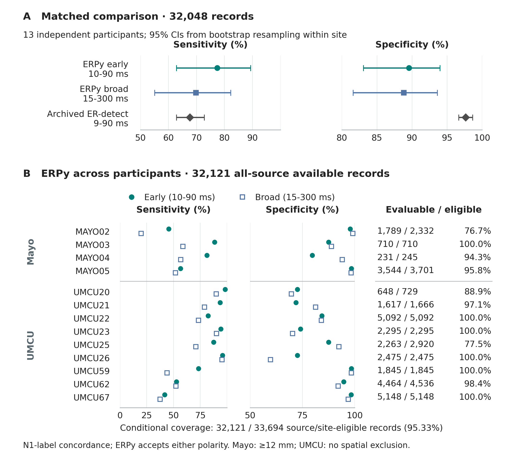

# External evaluation using released ER-detect data

Project: [ERPy: an auditable complete pipeline for intracranial stimulation response detection and analysis](../README.md).

The prepared analysis adds fixed-setting ERPy predictions to the public
[ER-detect dataset, OpenNeuro ds004774 version 1.0.0](https://openneuro.org/datasets/ds004774/versions/1.0.0),
released under CC0. The scientific comparison is with the actual archived
negative-peak outputs accompanying [Van den Boom et al., 2025](https://doi.org/10.1016/j.jneumeth.2025.110389).
It is not a new execution or tuning of the ER-detect source package.

The primary cohort contains **13 independent participants**: four Mayo and
nine UMCU. MAYO01 overlaps the earlier ds003708 worked example and is retained
only in secondary replication views. The overlap exclusion followed Mayo
pilot scoring and preceded UMCU scoring; no detector parameters changed.
The [analysis protocol](../validation/ERDETECT_VALIDATION_PROTOCOL.md) records
this amendment and the fixed settings.

| Available-case N1-annotation concordance | Sensitivity | Specificity | PPV |
| --- | ---: | ---: | ---: |
| ERPy early, 10–90 ms | 77.40% | 89.59% | 52.78% |
| ERPy manuscript window, 15–300 ms | 69.79% | 88.84% | 48.45% |

Conditional coverage is **32,121/33,694 source- and site-eligible labeled records
(95.33%)**. An additional **5,901** otherwise eligible labeled records lack
matching events in the pinned released recordings. Expanded annotation-frame
coverage is therefore **32,121/39,595 (81.12%)**. This is a source-availability
audit, not an accuracy estimate: missing inputs are never assigned observed
negative detector calls.

| Primary 13-participant annotation/source flow | Records |
| --- | ---: |
| Unique channel–stimulation-pair records with at least one valid reference | 44,795 |
| Exclude contact or stimulation membership ineligibility | 4,559 |
| Exclude no matching source events | 5,901 |
| Exclude fewer than five good source events | 73 |
| Remaining source-eligible records | 34,262 |
| Exclude site spatial ineligibility | 568 |
| Source- and site-eligible denominator | 33,694 |
| Documented raw truncation prevents a prediction | 657 |
| Detector unavailable | 916 |
| Evaluable by ERPy | 32,121 |

Exclusions follow the displayed mutually exclusive hierarchy; the underlying
record table retains overlapping reasons. The five-event source criterion is
separate from the detector's minimum of eight retained trials. The 5,901
absent-source records comprise 75 stimulation pairs in UMCU20, UMCU25 and
UMCU62 (4,960, 876 and 65 records, respectively). Each has only one available
rater. Their N1-positive reference fraction is 21.23%, versus 12.75% in the
source- and site-eligible denominator. UMCU20's expanded coverage is 648/5,689
(11.39%). These differences limit generalization from the released-source slice.
No verified mapping of the extra annotations to another raw recording is
available; the released ER-detect comparison also uses the narrower source slice.

On the
**32,048 paired available records** with comparable archived trial sets,
early ERPy yielded 77.41% sensitivity and 89.57% specificity; archived ER-detect
yielded 67.61% and 97.64%. Their PPVs were 52.72% and 81.17%. This is a sensitivity–
specificity tradeoff, not superiority. Site and participant heterogeneity and
whole-participant bootstrap intervals are reported in the saved tables.



Each channel–stimulation-pair record has total reference weight one, split
equally across available raters. Fractional confusion counts therefore target
a randomly selected available rater within a record; they are not majority
votes or equally weighted participant averages. Both ERPy windows accept either
polarity, while the reference labels target early negative N1 activity. P1
annotations remain negative for that endpoint. ER-detect itself supports
positive and negative early responses and three detection modes; this comparison
uses its archived negative-N1 output. ERPy's complementary contribution is the
explicit conjunction of projection and energy evidence and its recorded analysis
contract. Discordance can include positive
or later activity, residual artifact, or error; these labels cannot distinguish
them. Explicit P1 annotations account for 9.5% of early-window and 6.5% of
broad-window N1 false-positive reference weight among evaluable independent-cohort
records; polarity mismatch does not explain most discordance. The evaluation
uses released good-channel/event eligibility and does not
validate the complete ERPy response-derived QC pipeline.

Mayo analysis excludes distances below 12 mm from either stimulation contact.
UMCU coordinates are not released, so its eligibility has no distance exclusion.
The truncated UMCU25 raw source leaves 11 pairs unavailable and one partially
recovered pair; that partial pair is excluded from paired archived comparisons.
Incomplete processing is rejected rather than represented as a negative result.

## Inspect the evidence without downloading recordings

- [Metrics and clustered uncertainty](../validation/frozen_results/erdetect/metrics.csv)
- [Exclusion denominators](../validation/frozen_results/erdetect/record_exclusion_denominators.csv)
- [Complete annotation-to-source flow, including every participant](../validation/frozen_results/erdetect/coverage_audit/annotation_source_flow.csv)
- [Additional annotated pairs without matching source events](../validation/frozen_results/erdetect/coverage_audit/source_event_absent_pairs.csv)
- [Per-rater agreement](../validation/frozen_results/erdetect/interrater_agreement.csv)
- [Annotation-category discordance](../validation/frozen_results/erdetect/annotation_category_discordance.csv)
- [Complete interpretation and source checksums](../validation/frozen_results/erdetect/summary.json)
- [Saved evidence audit](../validation/frozen_results/erdetect/SCORING_AUDIT.md)

The compressed record/rater joins preserve all rows. `prediction_files.tar.gz`
preserves the individual prediction CSVs, exact integer seeds, q-values and
family membership. The software commit recorded in the original scoring
summary identifies its checkout; the separately recorded scorer SHA256 identifies
the then-uncommitted scorer. Final publication should cite the prepared
repository commit as well as the retained run manifest. No raw governed
CNS/ACC–PAG data are included in these external-validation artifacts.

## Reproduce Figure 6 and coverage counts

From a checkout of this revision, with the numerical dependencies installed:

```bash
python validation/plot_erdetect_validation.py \
  --metrics validation/frozen_results/erdetect/metrics.csv \
  --output ./validation_figures/fig06_external_validation
```

Add `--frontiers` for the ≥2 pt stroke variant. The plotter exports vector PDF/SVG,
preview PNG and 600 dpi RGB TIFF with caption, alt text, plotted data and QA metadata.

The annotation/source flow can be reproduced without downloading raw data:

```bash
python validation/audit_annotation_coverage.py \
  --records validation/frozen_results/erdetect/record_predictions_and_labels.csv.gz \
  --output ./validation_figures/coverage_audit
```

## Reproduce from public recordings

Run from this repository's root. The tested analysis used Python 3.12.5 on
macOS arm64. The detector/scorer used NumPy 1.26.4, SciPy 1.13.1 and pandas 2.2.2;
raw extraction used a separate environment, including pymef 1.4.8. These are
reproduction environments, not changes to the package-wide minimum requirements.
A raw-data rerun downloads several gigabytes and performs many randomizations.
Use an external run directory and keep its receipts. No GitHub account is needed
to retrieve these public inputs.

```bash
python3.12 -m venv .venv-validation
.venv-validation/bin/python -m pip install -r validation/requirements-erdetect-analysis.txt
.venv-validation/bin/python -m pip install --no-deps -e .
python3.12 -m venv .venv-extraction
.venv-extraction/bin/python -m pip install -r validation/requirements-erdetect-extraction.txt

.venv-validation/bin/python validation/run_erdetect_validation.py --root ../erpy-validation-run --stage prepare --stage download
.venv-extraction/bin/python validation/run_erdetect_validation.py --root ../erpy-validation-run --stage extract
OPENBLAS_NUM_THREADS=1 OMP_NUM_THREADS=1 VECLIB_MAXIMUM_THREADS=1 .venv-validation/bin/python validation/run_erdetect_validation.py --root ../erpy-validation-run --stage predict --stage reconstruction --stage score --stage coverage --stage figure
```

The command forms above target macOS/Linux. The MEF reader is an optional raw
extraction dependency; this complete validation recipe has not been tested on
Windows. On Windows, saved results remain readable and plotting/scoring can be
used where their dependencies are available.

`--dry-run` prints the exact underlying commands without executing them.
`--stage all` runs the stages in dependency order, including the separate coverage
audit after scoring. When invoking all stages from the analysis environment, pass
`--extraction-python .venv-extraction/bin/python` so extraction uses its own dependencies.
UMCU extraction fetches verified HTTP byte ranges instead of entire raw files;
header-derived sampling rates control alignment. Atomic caches record the input
ranges and source identities. The published UMCU25 truncation is retained,
not repaired with invented data. Use a fresh run/output directory after changing
code or analysis settings; the saved report must not be replaced by a tuned run.

New prediction CSVs have a matching `.csv.receipt.json` file. Reuse requires the
same epoch hash, every resolved detector setting, preprocessing and family settings,
seed policy, ERPy/predictor source hashes, and numerical dependency/build fingerprint.
The receipt also verifies the CSV hash, schema, and complete channel/configuration
grid. Missing, changed, incomplete, or corrupt receipts/CSVs raise an error; rerun
prediction into a fresh output directory. CSVs and receipts are written atomically,
with the receipt published last, so an interrupted write cannot become a valid cache.

For a scoring-only reproduction, initialize a fresh directory with
`--stage prepare --frozen-predictions`. Download the archived MAT files using
`download_erdetect_public.py` with `--archived-calls` and all 14 subject flags
(the dry-run download plan shows the command). Then run the `score`, `coverage` and `figure`
stages. This avoids trial extraction and ERPy prediction; it still requires the
archived comparator arrays. Our independent staging check reproduced every
numeric metric and row-level join from the packaged metadata and predictions.
The original saved prediction CSVs predate these cache receipts and remain
score-only evidence. Preparation restores their exact bytes without manufacturing
new inference receipts; they cannot be reused by the prediction stage. The wrapper
rejects `--frozen-predictions` with `predict` or `all`.

[Cache safeguard verification](../validation/frozen_results/erdetect/cache_safeguard_verification.json)
records the 219-test check and one fresh public MAYO04/LG2-LG3 rerun: all 38 rows
matched the saved prediction fields exactly, excluding runtime duration. This
checks the cache change on that pair; it is not a fresh execution of all public pairs.

## Realized support in new prediction exports

Current exports add `response_start_s`, `response_stop_s`, `baseline_start_s`,
`baseline_stop_s`, matched sample counts and JSON `clean_trial_indices`. Times
are the first and last selected samples in seconds, with inclusive endpoints;
indices refer to the input epoch trial axis. Unavailable windows have zero
sample counts and blank realized endpoints. A supported window can still have
insufficient clean trials, in which case its support and finite-trial indices
remain recorded while inference is unavailable. Cache schema 2 prevents an older
compact CSV from being reused as if it contained these fields.

The [108-row public example](../validation/prediction_provenance_example.csv)
reruns MAYO02/LAS1-LAS2 on both declared configurations. All previous scientific
fields, including p-values, adjusted calls and counts, matched exactly;
[the verification receipt](../validation/prediction_provenance_export_verification.json)
records the source hash and checks. Elapsed time is excluded from that comparison.
The historical verification associated with that receipt passed 298 tests. Saved exports are preserved
unchanged and omit these added fields; their extraction metadata reconstructs
sample support, while exact clean-trial selection also requires source finite masks.

## Relationship to the lead example

The [executed lead notebook](../notebooks/examples/00_quickstart.ipynb) uses an
actual deidentified recording from the governed CNS/ACC–PAG analysis cohort.
It is a separate illustration and is not synthetic. Its authorized source is
loaded externally. The public ds004774 evaluation above and fully generated
simulation benchmarks serve separate validation purposes.
